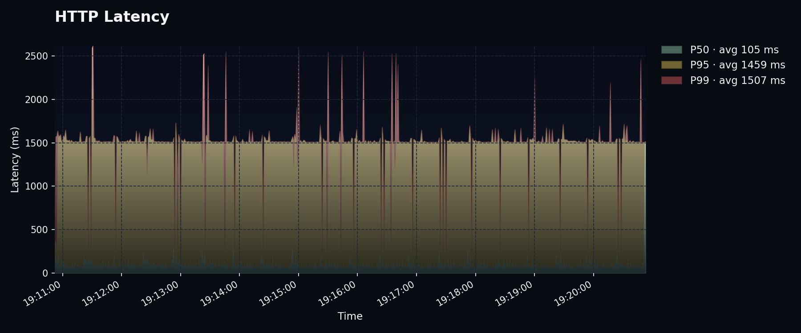
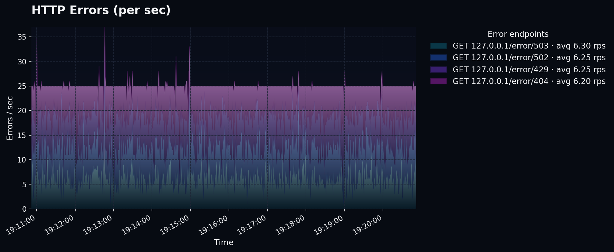

```
██╗██████╗  ██████╗ ███╗   ██╗    ███████╗██╗    ██╗ █████╗ ██████╗ ███╗   ███╗
██║██╔══██╗██╔═══██╗████╗  ██║    ██╔════╝██║    ██║██╔══██╗██╔══██╗████╗ ████║
██║██████╔╝██║   ██║██╔██╗ ██║    ███████╗██║ █╗ ██║███████║██████╔╝██╔████╔██║
██║██╔══██╗██║   ██║██║╚██╗██║    ╚════██║██║███╗██║██╔══██║██╔══██╗██║╚██╔╝██║
██║██║  ██║╚██████╔╝██║ ╚████║    ███████║╚███╔███╔╝██║  ██║██║  ██║██║ ╚═╝ ██║
╚═╝╚═╝  ╚═╝ ╚═════╝ ╚═╝  ╚═══╝    ╚══════╝ ╚══╝╚══╝ ╚═╝  ╚═╝╚═╝  ╚═╝╚═╝     ╚═╝
```

[](https://github.com/ryan-h265/ironswarm/actions/workflows/test.yml)
[](https://github.com/ryan-h265/ironswarm/actions/workflows/docker.yml)
[](https://badge.fury.io/py/ironswarm)
[](https://www.python.org/downloads/)

-----

<p align="center">
  
  
  
</p>


## Table of Contents

- [Installation](#installation)
- [Usage](#usage)
- [Web Dashboard](#web-dashboard)
- [Docker](#docker)
- [Development](#development)
- [License](#license)


## Installation

```console
pip install ironswarm
```

## Usage

```
usage: ironswarm [-h] [-b BOOTSTRAP] [-H HOST] [-p PORT] [-j JOB] [-v | --verbose | --no-verbose] [-s | --stats | --no-stats] [--log-file LOG_FILE]
                 [--metrics-snapshot METRICS_SNAPSHOT]

options:
  -h, --help            show this help message and exit
  -b BOOTSTRAP, --bootstrap BOOTSTRAP
                        bootstrap node(s) to initially connect to
  -H HOST, --host HOST  network interface to bind to local/public or IP address (default: public)
  -p PORT, --port PORT  port to bind to (default: 42042)
  -j JOB, --job JOB     job to run (default: None)
  -v, --verbose, --no-verbose
                        enable verbose logging
  -s, --stats, --no-stats
                        enable stats output
  --log-file LOG_FILE   Optional path to write logs to a file.
  --metrics-snapshot METRICS_SNAPSHOT
                        Path to write aggregated metrics when the node exits.
```


Run a single node with no bootstrap
```bash
ironswarm -H local
```

Run multiple nodes in a tmux session
```bash
./example/multi.sh
```

Run a single node bootstrapping to another node
```bash
ironswarm -H local -b tcp://127.0.0.1:42042
```

## Web Dashboard

IronSwarm includes a built-in web dashboard for real-time monitoring and control of your load tests. The dashboard provides:

- **Real-time metrics** - Live graphs showing throughput, latency, and error rates
- **Cluster management** - View all connected nodes and their status
- **Scenario control** - Start, stop, and configure load test scenarios
- **Historical data** - View past test runs and compare results
- **Datapool management** - Upload and manage test data files

### Enabling the Dashboard

Start IronSwarm with the `--web-port` flag to enable the web interface:

```bash
ironswarm --web-port 8080
```

Then open your browser to `http://localhost:8080`

### Dashboard Features

- **Metrics View**: Real-time charts showing requests/sec, latency percentiles, and error rates
- **Scenario Builder**: Visual interface for creating and editing test scenarios
- **Cluster View**: Monitor all nodes in your distributed test cluster
- **Reports**: Generate and download detailed test reports

### No npm Required

The web dashboard is pre-built and shipped with IronSwarm - no need to install Node.js or npm. Just install via pip

## Docker

Pull the latest image:
```bash
docker pull ghcr.io/ryan-h265/ironswarm:latest
```

Run the latest image:
```bash
docker run -it ghcr.io/ryan-h265/ironswarm:latest ironswarm -H local
```

#### Running with Custom Scenario Files

To run the container with your own scenario files, copy them into the running container:

1. Start the container with a name:
```bash
docker run -d --name ironswarm-node ghcr.io/ryan-h265/ironswarm:latest tail -f /dev/null
```

2. Copy your scenario file into the container:
```bash
docker cp examples/http_scenario.py ironswarm-node:/usr/src/app/http_scenario.py
```

3. Execute ironswarm with your scenario:
```bash
docker exec -it ironswarm-node ironswarm -j http_scenario:scenario -H local
```

4. Clean up when done:
```bash
docker stop ironswarm-node
docker rm ironswarm-node
```

## Development

Useful hatch commands
```console
hatch run types:check
hatch test --cover
```

## License

This project is licensed under the MIT License. See the [LICENSE](LICENSE) file for details.
